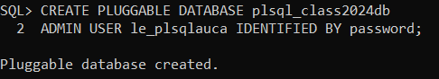
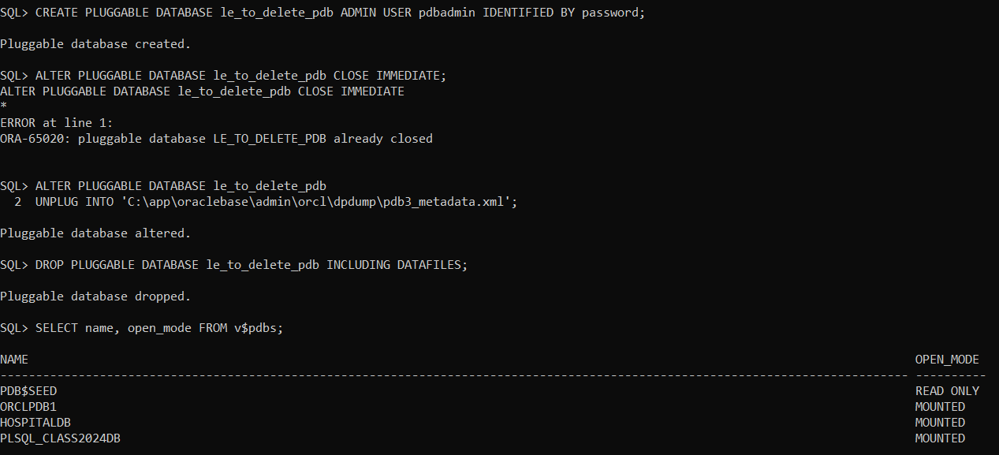
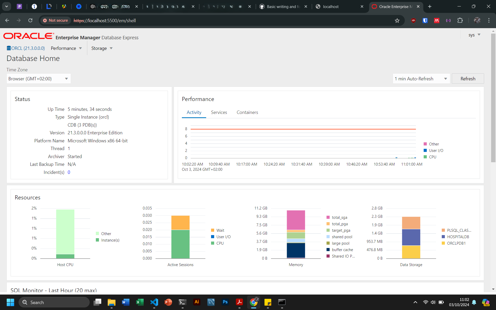

# Oracle Database Administration Tasks

This repository contains SQL scripts for managing Oracle Pluggable Databases (PDBs) and configuring Oracle Enterprise Manager (OEM). The tasks are split into three parts: creating a PDB, managing and deleting a PDB, and configuring OEM.

## Table of Contents

1. [Task 1: Create a New Pluggable Database (PDB)](#task-1-create-a-new-pluggable-database-pdb)
2. [Task 2: Create and Delete a Pluggable Database](#task-2-create-and-delete-a-pluggable-database)
3. [Task 3: Configure Oracle Enterprise Manager (OEM)](#task-3-configure-oracle-enterprise-manager-oem)
4. [Conclusion](#conclusion)

---

## Task 1: Create a New Pluggable Database (PDB)

In this task, we create a new Pluggable Database (PDB) and assign an admin user to it.

### SQL Script

```sql
-- Connect to the CDB
sqlplus sys as sysdba

-- Create a new PDB and assign an admin user
CREATE PLUGGABLE DATABASE plsql_class2024db
ADMIN USER le_plsqlauca IDENTIFIED BY password;
```



### Explanation

- `CREATE PLUGGABLE DATABASE`: This command creates a new PDB named `plsql_class2024db`.
- `ADMIN USER`: The admin user `le_plsqlauca` is assigned to the newly created PDB, and its password is set to `password`.
- Since `Oracle Managed Files (OMF)` is enabled, Oracle will automatically handle the placement of the data files in the default directory specified by the OMF configuration.
- To check if OMF is enabled in your database, you can run this query:

```sql
SHOW PARAMETER db_create_file_dest;
```

- If this parameter returns a directory path (e.g., `C:\db_home\oradata\orcl\`), then OMF is enabled, and Oracle will automatically create the data files in that directory.
- If it returns nothing or is not set, then OMF is not enabled, and Oracle will expect you to specify the data file locations manually.

## Task 2: Create and Delete a Pluggable Database

This task involves creating a new PDB that will later be dropped.

### SQL Script

```sql
-- Create a PDB that will be dropped
CREATE PLUGGABLE DATABASE le_to_delete_pdb ADMIN USER pdbadmin IDENTIFIED BY password;

-- Close the PDB
ALTER PLUGGABLE DATABASE le_to_delete_pdb CLOSE IMMEDIATE;

-- Get the correct directory path for the PDB
SELECT directory_name, directory_path FROM dba_directories;

-- Unplug the PDB from the container
ALTER PLUGGABLE DATABASE le_to_delete_pdb
UNPLUG INTO 'C:\app\oraclebase\admin\orcl\dpdump\pdb3_metadata.xml';

-- Drop the PDB and its associated datafiles
DROP PLUGGABLE DATABASE le_to_delete_pdb INCLUDING DATAFILES;

-- Verify that the PDB has been dropped
SELECT name, open_mode FROM v$pdbs;
```



### Explanation

- **Create a New PDB**: `le_to_delete_pdb` is created with an admin user `pdbadmin`.
- **Close the PDB**: The existing PDB `le_plsqlauca` is closed using `CLOSE IMMEDIATE`.
- **Get Directory Path**: The SQL command retrieves the correct directory path to be used for unplugging the PDB.
- **Unplug the PDB**: The `UNPLUG` command exports the PDB's metadata into an XML file located in `C:\app\oraclebase\admin\orcl\dpdump\`.
- **Drop the PDB**: The `DROP` command removes the PDB along with its associated datafiles.
- **Verify**: The `SELECT` command checks if the PDB has been successfully dropped.

## Task 3: Configure Oracle Enterprise Manager (OEM)

This task involves configuring Oracle Enterprise Manager (OEM) by ensuring that the HTTP/HTTPS ports are enabled.

### SQL Script

```sql
-- Check if connected to the root container
SHOW CON_NAME;

-- If not connected, set the session to the root container
ALTER SESSION SET CONTAINER = CDB$ROOT;

-- Check if the HTTP and HTTPS ports are enabled
SELECT DBMS_XDB_CONFIG.gethttpsport() AS https_port,
DBMS_XDB_CONFIG.gethttpport() AS http_port FROM dual;

-- If ports return 0, enable the HTTP and HTTPS ports
BEGIN
    DBMS_XDB_CONFIG.SETHTTPPORT(8080);
    DBMS_XDB_CONFIG.SETHTTPSPORT(5500);
END;

-- Verify the port settings again
SELECT DBMS_XDB_CONFIG.gethttpsport() AS https_port,
DBMS_XDB_CONFIG.gethttpport() AS http_port FROM dual;

-- Restart the database
SHUTDOWN IMMEDIATE;
STARTUP;
```

### Explanation

- **Connect to PDB**: Use `sqlplus` to connect to the PDB `plsql_class2024db`.
- **Check Root Container**: Run `SHOW CON_NAME` to verify if you are connected to the root container.
- **Enable Ports**: If the HTTP/HTTPS ports are disabled, set them using the `DBMS_XDB_CONFIG` package to enable HTTP on port `8080` and optionally HTTPS on `5500`.
- **Restart the Database**: Use the `SHUTDOWN IMMEDIATE` and `STARTUP` commands to restart the database after configuring the ports.

### Accessing Oracle Enterprise Manager

Once the configuration is done, access Oracle Enterprise Manager using the URL below:

```bash
https://localhost:5500/em
```



## Conclusion

This repository covers essential tasks for managing Oracle Pluggable Databases and configuring Oracle Enterprise Manager. This `README.md` file is designed to be comprehensive and provides detailed explanations of each step and SQL command used.
